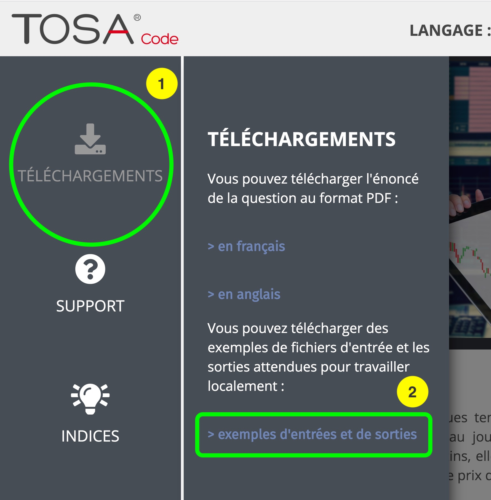
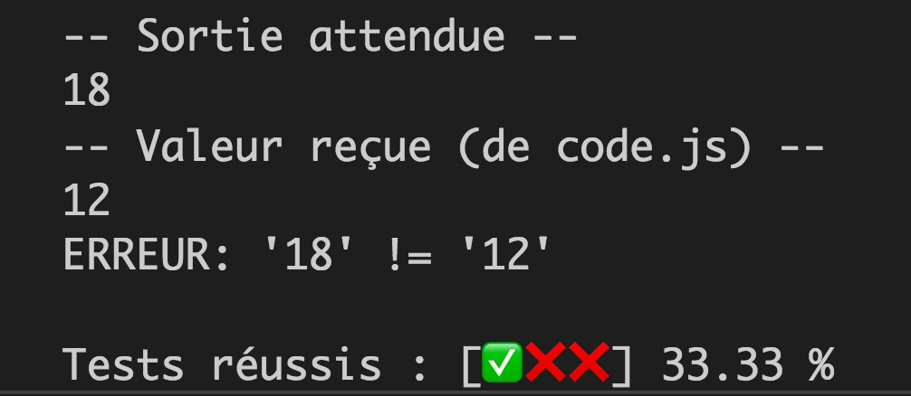
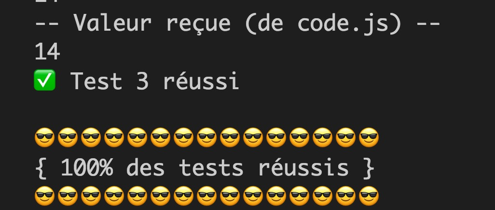

# Faites la Battle Dev depuis Visual Studio Code !

Ce script PHP vous permet de tester vos réponses (en langage PHP) aux exercices de la [Battle Dev](https://battledev.blogdumoderateur.com/) directement depuis VSCode ou autres éditeurs intelligent.

Il s'appuie sur les fichiers d'exemple fournis lors de la Battle Dev pour tester en local, votre code en PHP.

> Si vous utilisez un autre langage que le PHP, vous pouvez vous inspirer de mon script pour l'adapter à votre langage préféré.

Le script d'origine est fait pour du Js, disponible à cette adresse : [BattleDev-vscode](https://github.com/javascriptdezero/BattleDev-vscode).

## Quel intérêt ?

L'éditeur fourni lors de la Battle Dev ne permet pas de déboguer et est très sommaire. C'est beaucoup plus confortable de coder dans son IDE préféré avec toutes les extensions qui facilitent le développement, l'auto-complétion etc.

## Comment ça marche ?

Lors de la prochaine Battle Dev, il vous suffira de suivre les étapes suivantes pour faire un exercice :

1. Téléchargez le fichier ZIP d'exemple et décompressez son contenu dans le dossier `tests` (ça devrait être un ensemble de fichiers nommés `input1.txt`, `input2.txt` etc. et `output1.txt`, `output2.txt` etc.).



2. Développez le code répondant à l'exercice dans la fonction `ContestResponse` du fichier `code.php` :

```php
// -- Coller votre code dans la fonction ContestResponse ci-après
function ContestResponse() {
  // Implémentez votre code ci-dessous
}
// -- Fin du code à tester
```

3. Affichez vos réponses en utilisant l'instruction `echo`.
4. Assurer vous d'avoir séléctionné pour vscode "Launch currently open script" en mode débuggage. (Voir le fichier ressources 'lunch.json')
5. Lancez le script node `run.php` depuis VSCode (raccourci clavier `CTRL+F5` ou `F5` pour déboguer).
6. Vérifier le résultat dans la console de débogage.
7. Si tous les tests passent, vous pouvez copier-coller votre code (contenu dans `ContestResponse` + vos fonctions) dans l'éditeur officiel de la Battle Dev et valider. Sinon retournez à l'étape 2.
8. Une fois que votre exercice est validé, supprimez votre code dans `code.php`, supprimez tous les fichiers dans le dossier `tests`.
9. Passez à l'exercice suivant et retournez à l'étape 1.

## Affichage des résultats

Le script affiche pour tous les tests d'un même exercice les valeurs d'entrée, les valeurs de sortie attendues (en général juste une ligne) et les valeurs reçues de la part de votre code.

Voici ce qu'il affichera dans les différents cas.

Aucun test réussi : 
Certains tests (ici un seul) réussis : 
Tous les tests réussis : 

## Adapter à son IDE
J'utilise vscode pour le débogage, mais vous pouvez utiliser n'importe quel éditeur de texte qui supporte les fonctions de débogages. <br />
Si vous utilisez vscode, le fichier de configuration ce situe dans "ressources/configuration IDE/lunch.json" <br />
Si vous n'utilisez pas vscode mais que vous avez fait un fichier de configuration, n'hésitez  pas à le soumettre  avec un pull-request pour en faire profiter la communauté =D.


## Adaption du code à faire le jour J

Je me suis basé sur le fonctionnement de l'éditeur de la dernière Battle Dev datant de novembre 2019.

Il se peut que des modifications aient été apportées pour la prochaine édition et qu'il faille par exemple changer l'instruction permettant d'afficher le résultat (`echo`).

> Prenez le temps de vous approprier le code pour être capable de le modifier rapidement si besoin le jour J !

Vérifiez la façon dont vous devrez soumettre vos résultats en regardant en haut de l'éditeur :


Changez ce qui est nécessaire dans le script pour que ça fonctionne.

## Exercices des années précédentes

Une compilation des énoncés et tous les fichiers de test des saisons 11, 12, 13, et 14 de la Battle Dev sont dans le dossier `exercices`.

Vous pouvez les utiliser pour vous entraîner !

Pour ce faire rien de plus simple. Supposons que vous vouliez faire l'exercice 2 de la saison 12.

Copiez tous les fichiers du dossier `Exercice 2 - Mots magiques` dans `tests`. Vous pouvez inclure `enonce.txt`, ce n'est pas gênant pour le script. Vous êtes prêt à coder comme expliqué dans la section [comment ça marche](#comment-ça-marche-).

## Vous aimez ? Partagez ce dépôt !

N'hésitez pas à partager ce dépôt sur les réseaux sociaux et à cliquer l'étoile en haut à droite si vous appréciez ce script.

## Auteur
Auteur : Fabacks <br />
Site : https://dahoo.fr <br />
Github : https://github.com/Fabacks


## Auteur d'origine

Site : https://www.javascriptdezero.com <br />
Vous pouvez également me faire un petit coucou sur Twitter : [@JeremyMouzin](https://twitter.com/jeremymouzin).

### Je code en Français, voici pourquoi

Dans un but pédagogique et pour donner accès à du code rédigé en Français aux non-anglophones, j'ai fait le choix de rédiger mon code source et mes commentaires en Français.

Merci et à bientôt 😘.